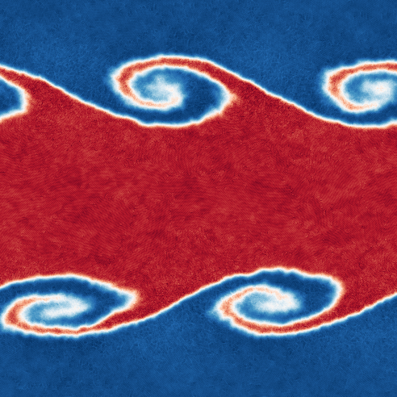

## The Kelvin-Helmholtz Instability

A crowd favourite for testing hydrodynamics schemes is the Kelvin-Helmholtz
instability. This instability looks at two shearing layers of fluid. In this
simulation, we will set up the following initial condition:

```
+----------------------------------------------+
|                                              |
|                  P   = 2.5                   |
|     <-----+      v   = -0.5      <-----+     |
|                  rho = 1.0                   |
|                                              |
+----------------------------------------------+
|                                              |
|     +----->                      +----->     |
|                                              |
|                                              |
|                  P   = 2.5                   |
|     +----->      v   = 0.5       +----->     |
|                  rho = 2.0                   |
|                                              |
|                                              |
|     +----->                      +----->     |
|                                              |
+----------------------------------------------+
|                                              |
|                  P   = 2.5                   |
|     <-----+      v   = -0.5      <-----+     |
|                  rho = 1.0                   |
|                                              |
+----------------------------------------------+
```

which is a 2D plane that is periodic in both directions. This causes shear at
the contact points, which develops nicely into an instability - should your
hydrodynamics scheme be able to resolve contact discontinuities well.

To run this example, you will need to reconfigure with the `anarchy-du`
scheme and in 2D. Once you have performed that step, change to the directory
`examples/HydroTests/KelvinHelmholtz_2D` and run the `run.sh` script.
This will take quite some time to run (5-10 minutes). If you attempt this with
one of the schemes that uses a Riemann solver, it will take significantly
longer.

After running the example, you should be able to run the `makeMovieSwiftsimIO.py`
script. This will create a movie for you of your results, saved as `khmovie.mp4`.
The movie should look something like this:



Take a look at the movie script; in the next example we will build our own!

Next: [Simulating a Galaxy](simulating_a_galaxy.md)