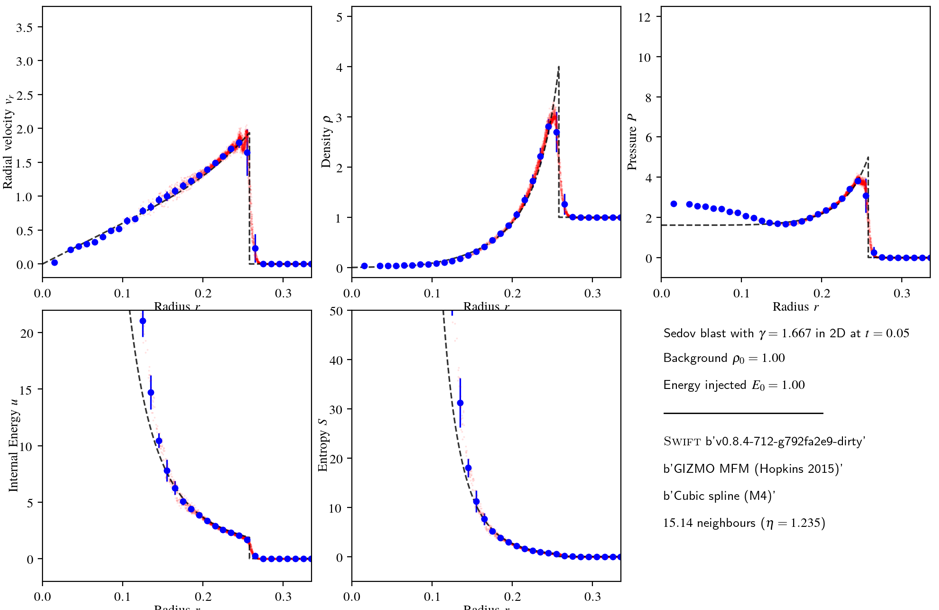
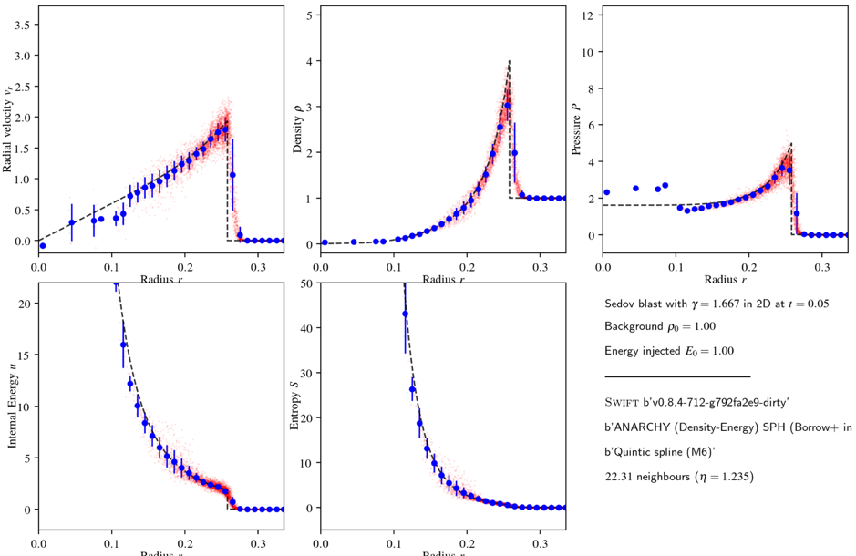

## Shock performance

A common test for SPH codes in astrophysics is to look at how well they
handle strong shocks. This test effectively looks at the artificial viscosity
implementation, as without this SPH schemes (as used in Astrophysics) are
completely dissipationless (they can not turn kinetic energy into thermal
energy).

The example in the SWIFT repository to test shock performance is called the
Sedov Blast – which is available in 1D, 2D, and 3D variants
(`examples/HydroTests/SedovBlast_{1,2,3}D`).

Using what you learned above, you should re-configure the code and run each
of these with both the `anarchy-du` and `gizmo-mfm` schemes. The latter
requires a Riemann solver. You could also try changing the kernel
(`--with-kernel=?` At configure time). More information is available from
`./configure --help`. For some kernels, you will also need to supply
`--disable-hand-vec`.

The resulting plots should look like the following:

or for the GIZMO-MFM scheme:

Next: [Simulating a Galaxy](simulating_a_galaxy.md)
