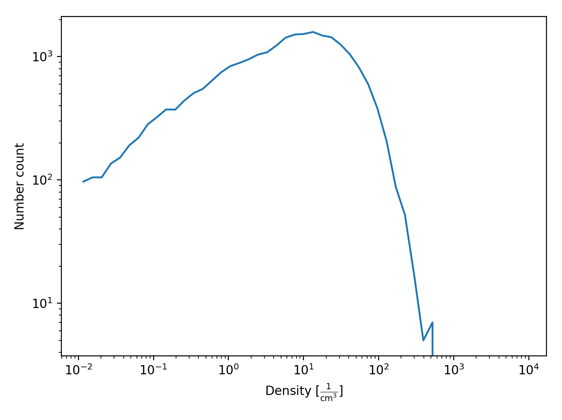
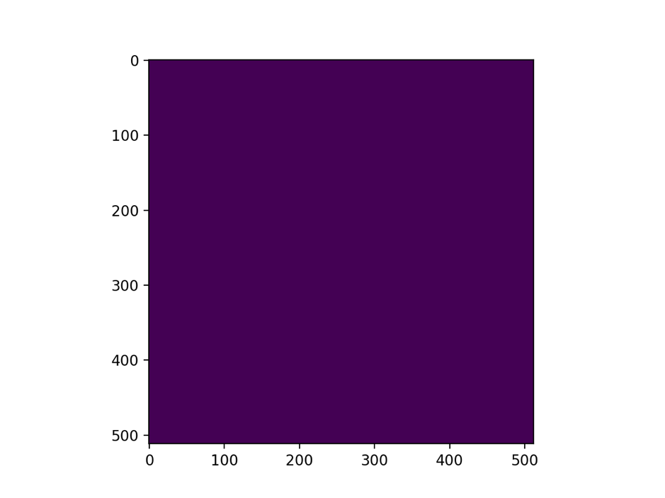
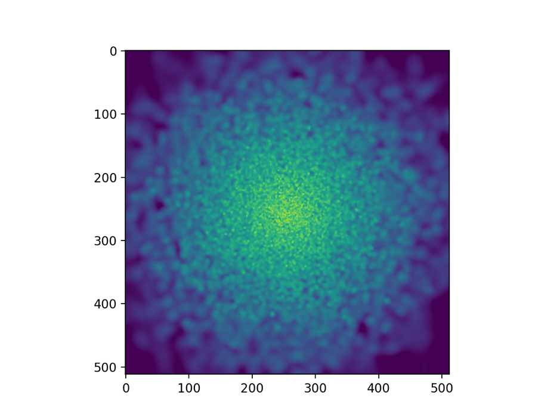

## Simulating a galaxy

To perform a reasonable simulation of a galaxy, you will need to use a galaxy
formation sub-grid model. This tells the code how and when to form stars, how
they should have a back-reaction on the gas, and how the gas should cool.

For this example the EAGLE sub-grid model will be used. To configure the code
with the EAGLE model, you will need to configure with the
`--with-subgrid=EAGLE` flag.

Because we will be running an isolated galaxy, you will also need to use an
‘external potential’. This simulates the effects of dark matter, without
needing to resort to simulating the individual dark matter particles, by
imposing a fixed gravitational potential on all particles. To configure with
this, you will need to use the `--with-ext-potential=hernquist`.

You should use the `anarchy-du` hydrodynamics scheme (no need for a Riemann
solver) with this example, with your choice of kernel.

Once you have configured and built the code, you should change to the
`examples/IsolatedGalaxy/isolatedgalaxy_feedback` directory and run it. This
will download:

+ The initial conditions
+ The cooling tables (this tells the gas how quickly to cool as a function
  of density, current temperature, etc.)
+ The yield tables (this tells the code how to inject metals back into the
  gas after forming stars)

Once this simulation has ran (it will take some time – you are simulating the
universe after all!) you will be left with 101 snapshots, from
`output_0000.hdf5` to `output_0100.hdf5`. If you want to run for longer, you can
– just edit the `isolated_galaxy.yml` parameter file and change the end time to
something larger than 0.1 (figuring the specifics out are an exercise left to
the reader).

Now that the simulation has finished, it is possible to analyse the output.
To do this, we will use the `swiftsimio` library that you should have already
installed from PyPI. `swiftsimio` uses `unyt` to associate physical units with
most quantities, and you can convert between them by using the units defined
within `unyt` itself.

It is best, for now, to either explore the data in a jupyter notebook, or an
interactive python shell (whichever you feel most comfortable with).

To load data, import the library and open the first snapshot:

```python
from swiftsimio import load
data = load("output_0000.hdf5")
```

Take a look around at the data structure. This top-level object ‘data’ has
several sub-objects – `data.metadata` (metadata about the snapshot and run,
such as information about the hydro scheme that was used), `data.gas` (the gas
datasets, not yet loaded from disk), and `data.stars` (the stellar datasets,
not yet loaded from disk).

The first, easy, piece of analysis is to ask what the distribution of
densities in this simulation is. Astronomers like to work in archaic units,
so we will follow that convention by making a histogram of densities in atoms
per cubic centimetre:

```python
from unyt import mh, cm

number_densities = data.gas.densities / mh
number_densities.convert_to_units(cm**-3)

import matplotlib.pyplot as plt
import numpy as np

bins = np.logspace(-2, 4) * cm**-3
bin_centers = 0.5*(bins[1:] + bins[:-1])

hist, _ = np.histogram(number_densities, bins=bins)

plt.loglog(bin_centers, hist)
plt.xlabel(f“Density [${number_densities.units.latex_repr}$]”)
plt.ylabel(“Number count”)

plt.tight_layout()
plt.show()
```

This will show a histogram of densities that should look something like this:



### Making pretty pictures

A much more interesting way to visualise this data would be to make an image
of your galaxy. `swiftsimio` has functionality to perform this task built in
through its `visualisation` sub-module. To make a quick image of the galaxy,
use the `project_gas` function:

```python
from swiftsimio.visualisation import project_gas
from matplotlib.colors import LogNorm

# This creates an SPH smoothed image of the mass density
image = project_gas(data, resolution=512)

# LogNorm as we have huge variations in density from pixel-to-pixel
plt.imshow(image, norm=LogNorm())

plt.show()
```

In a very anti-climactic result you will get the following image:



This occurs because we simulate the galaxy inside a large volume (relative to
the galaxy).

To get a better image, we need to constrain the dimensions of the image some
more. This can be done by setting the `region` parameter in the `project_gas`
function as follows (the galaxy has a radius of about 10 kpc, so we want to
view around 15 kpc, and the galaxy is in the middle of the box):

```python
from unyt import kpc, msun

# Need to ensure these are both in kpc to prevent overflows!
galaxy_size = 15.0 * kpc
half_box = data.metadata.boxsize[0].to(kpc) * 0.5

# This creates a 4-length list
bounds = [half_box – galaxy_size, half_box + galaxy_size] * 2

# Create an image of just the region we asked for
image = project_gas(data, resolution=512, region=bounds).to(msun / kpc**2)

# Finally, make a plot - with the units now being solar masses per square
# kiloparsec.
plt.imshow(image, norm=LogNorm(vmin=1e6, vmax=1e9))

plt.show()
```

This will result in a much clearer image like the following:



Before moving on you should take a look at the galaxy at some other times.
During the first 25 to 50 snapshots, it will be settling into equilibrium, but
after this the results should be very valid. You can take a look at the
time-scales involved by using the `data.metadata.t` variable which will
tell you the current value. You can convert this to millions of years by
using `unyt` (`from unyt import Myr` and `data.metadata.t.to(Myr)`).


### Smoothing other quantities

The previous visualisation calculates the smoothed mass density. You can
smooth other properties by passing the `project` argument to the `project_gas`
function. For example, you may wish to smooth the temperature, in which case
you need to find the smoothed number density (`project=None`) to divide out the
area dependence:

```python
from unyt import K

common_arguments = dict(
    data=data,
    resolution=512,
    region=bounds
)

image = project_gas(**common_arguments, project="temperatures")
image_unweighted = project_gas(**common_arguments, project=None)

# Convert the final image to Kelvin.
temp_map = (image / image_unweighted).to(K)
```

### Movies of your galaxy

At the moment we are just looking at a single snapshot, but to finish we will
make a movie of the galaxy. This can be performed in python through the use
of the `FuncAnimation` `matplotlib` API.

This API is a little convoluted, but after using it a few times it quickly
becomes familiar.

First, we must generate all of the frames that we wish to display.

Starting in a new shell/script,

```python
from swiftsimio import load
from swiftsimio.visualisation import project_gas

import matplotlib.pyplot as plt
from matplotlib.colors import LogNorm
from unyt import K


def make_frame(snapshot):
    data = load(f"output_{snapshot:04d}.hdf5")
    boxsize_x, boxsize_y, _ = (data.metadata.boxsize * 0.5).to(kpc)
    galaxy_size = 15.0 * kpc

    bounds = [boxsize_x - galaxy_size, boxsize_x + galaxy_size, boxsize_y - galaxy_size, boxsize_y + galaxy_size]

    image = project_gas(data, resolution=512, region=bounds, project="temperatures", parallel=True)
    image_unweighted = project_gas(data, resolution=512, region=bounds, project=None, parallel=True)

    return (image / image_unweighted).to(K).value

images = [make_frame(x) for x in range(100)]
```

Now we have the frames, we can use the FuncAnimation API to turn them into a movie:

```python
from matplotlib.animation import FuncAnimation

fig, ax = plt.subplots()
image = ax.imshow(images[0], norm=LogNorm(vmin=1e4, vmax=1e8), cmap="twilight")

def update(frame):
    image.set_array(images[frame])

    return image

anim = FuncAnimation(fig, update, range(100), interval=1000/25)

anim.save("galaxy_temperature_movie.mp4")
```

This will save the movie as `galaxy_temperature_movie.mp4` for you to view.
The red blobs are individual supernovae events.
