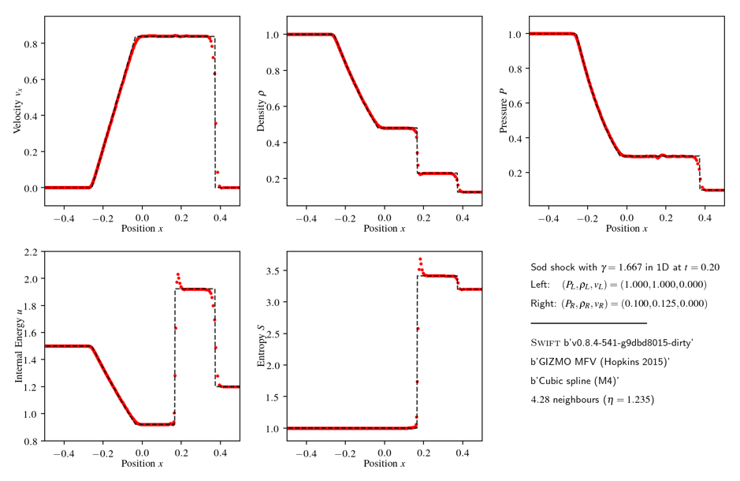

## Running Your First Example

The first example runs in one dimension, with the dimensions being a compile
time parameter. To make SWIFT run in one dimension, first re-configure and
compile:

```
./configure –-with-hydro-dimension=1

make
```

The first example is a Sod Shock, which is included with SWIFT. Change to
`examples/HydroTests/SodShock_1D`, and run the `run.sh` shell script. This will:

+ Create initial conditions using the `makeIC.py` python script
+ Run SWIFT using the included parameter file, `sodShock.yml`.
+ Create a plot of the output using the `plotSolution.py` python script. 

When you do each of these steps, you should look at the contents of each
file, with a particular focus on the `run.sh` file. SWIFT uses many
run-time command-line arguments to enable different features, and
set the threading options. You may wish to change the number of
`--threads` to something more suited to your own machine. Physics
and run-time parameters are set using the `yml` parameter file.

The output of the run is two HDF5 files, and a plot, which should look
something like this:


This shows the state of the simulation at `t=0.2`, with different variables
plotted in different panels (with the red dots showing all particles, and the
black dashed line showing the exact solution).

This is the solution with a very simple hydrodynamics model, a basic
implementation of SPH similar to the one outlined in Smoothed Particle
Hydrodynamics and Magnetohydrodynamics by Daniel Price[^SPHMHD]. 
To use a more complex model, such as a meshless finite volume scheme
(GIZMO-MFV), you will need to reconfigure:

```
./configure \
    --with-hydro-dimension=1\
    --with-riemann-solver=hllc\
    --with-hydro=gizmo-mfv

make
```

This will create a binary that is configured to use, as mentioned, a meshless
scheme with a HLLC Riemann solver.

Running the simulation again, this scheme remedies the pressure blip that is
associated with the artificial surface tension present in very simple SPH
models:



Next: [Shock Performance](shock_performance.md)

[^SPHMHD]: Available at https://arxiv.org/abs/1012.1885.
